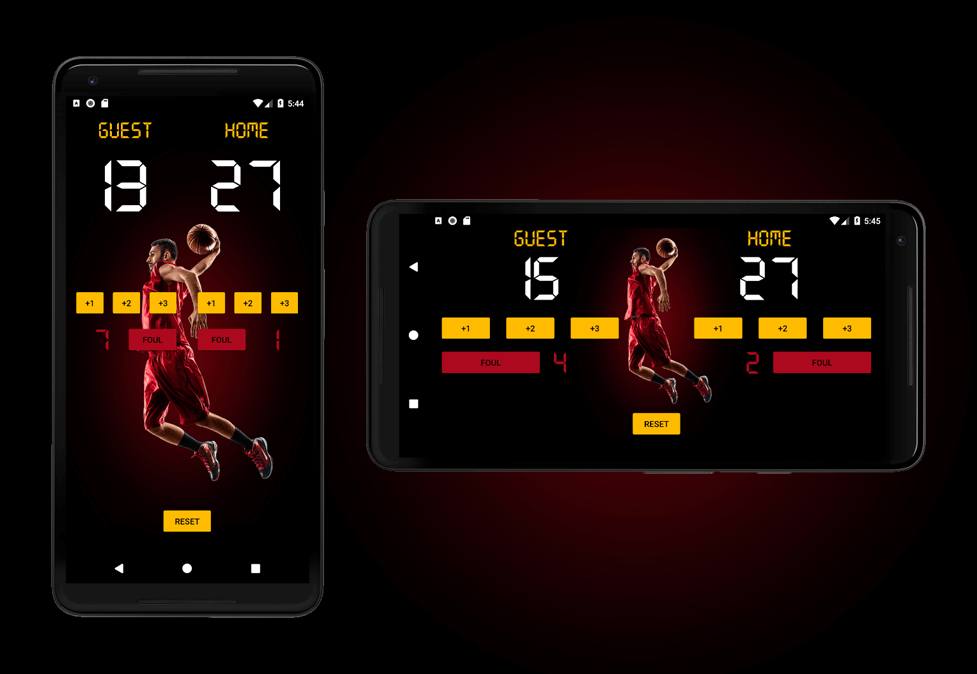

# Lesson 9: Project 2
## Court Counter App

***Part of the Grow with Google Developer Challenge Scholarship: Android Basics - Udacity***
I used **API 23: Android 6.0 (Marshmallow)**

**Includes:**
* **Vertical and horizontal layouts**: I did this by creating a copy of activity_main.xml, pasting it into a new folder under /res/ called /layout-land/, and then editing it to look good for landscape mode.
--> MyProject/res/layout/activity_main.xml (default/portrait)
--> MyProject/res/layout-land/activity_main.xml (landscape)
* Saves TextView states after rotation
* Custom non-Google font for the scoreboard: **digital.otf**
