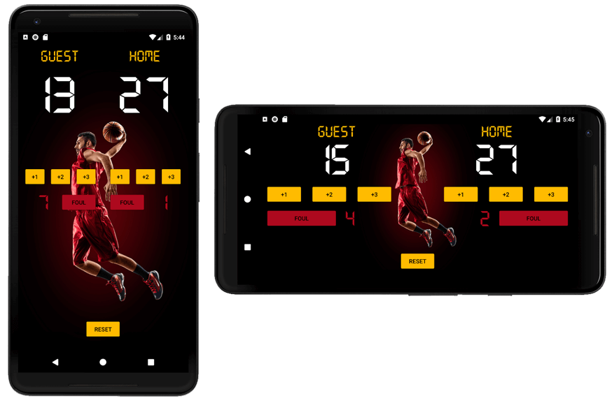

# Lesson 9: Project 2
## Court Counter App

***Part of the Grow with Google Developer Challenge Scholarship: Anroid Basics - Udacity***
I used **API 23: Android 6.0 (Marshmallow)**



**Includes:**
* **Vertical and horizontal layouts**: I did this by creating a copy of activity_main.xml, pasting it into a new folder under /res/ called /layout-land/, and then editing it to look good for landscape mode.
--> MyProject/res/layout/activity_main.xml (default/portrait)
--> MyProject/res/layout-land/activity_main.xml (landscape)
* Custom non-Google font for the scoreboard: **digital.otf**

### mainActivity.java

```package com.example.android.courtcounter;

import android.support.v7.app.AppCompatActivity;
import android.os.Bundle;
import android.view.View;
import android.widget.TextView;

public class MainActivity extends AppCompatActivity {

    int scoreTeamA = 0;
    int scoreTeamB = 0;
    int foulTeamA = 0;
    int foulTeamB = 0;

    @Override
    protected void onCreate(Bundle savedInstanceState) {
        super.onCreate(savedInstanceState);
        setContentView(R.layout.activity_main);
        displayForTeamA(0);
        displayForTeamB(0);
        displayFoulForTeamA(0);
        displayFoulForTeamB(0);
    }

    /**
     * Add 3 to score for Team A.
     */
    public void add3PointsForTeamA(View v) {
        scoreTeamA = scoreTeamA + 3;
        displayForTeamA(scoreTeamA);
    }

    /**
     * Add 2 to score for Team A.
     */
    public void add2PointsForTeamA(View v) {
        scoreTeamA = scoreTeamA + 2;
        displayForTeamA(scoreTeamA);
    }

    /**
     * Add 1 to score for Team A.
     */
    public void add1PointForTeamA(View v) {
        scoreTeamA = scoreTeamA + 1;
        displayForTeamA(scoreTeamA);
    }

    /**
     * Displays the given score for Team A.
     */
    public void displayForTeamA(int score) {
        TextView scoreView = (TextView) findViewById(R.id.team_a_score);
        scoreView.setText(String.valueOf(score));
    }

    /**
     * Add 3 to score for Team B.
     */
    public void add3PointsForTeamB(View v) {
        scoreTeamB = scoreTeamB + 3;
        displayForTeamB(scoreTeamB);
    }

    /**
     * Add 2 to score for Team B.
     */
    public void add2PointsForTeamB(View v) {
        scoreTeamB = scoreTeamB + 2;
        displayForTeamB(scoreTeamB);
    }

    /**
     * Add 1 to score for Team B.
     */
    public void add1PointForTeamB(View v) {
        scoreTeamB = scoreTeamB + 1;
        displayForTeamB(scoreTeamB);
    }

    /**
     * Displays the given score for Team B.
     */
    public void displayForTeamB(int score) {
        TextView scoreView = (TextView) findViewById(R.id.team_b_score);
        scoreView.setText(String.valueOf(score));
    }

    /**
     * Add 1 to fouls for Team A.
     */
    public void add1FoulForTeamA(View v) {
        foulTeamA = foulTeamA + 1;
        displayFoulForTeamA(foulTeamA);
    }

    /**
     * Displays the given fouls for Team A.
     */
    public void displayFoulForTeamA(int score) {
        TextView scoreView = (TextView) findViewById(R.id.team_a_foul);
        scoreView.setText(String.valueOf(score));
    }

    /**
     * Add 1 to fouls for Team B.
     */
    public void add1FoulForTeamB(View v) {
        foulTeamB = foulTeamB + 1;
        displayFoulForTeamB(foulTeamB);
    }

    /**
     * Displays the given fouls for Team B.
     */
    public void displayFoulForTeamB(int score) {
        TextView scoreView = (TextView) findViewById(R.id.team_b_foul);
        scoreView.setText(String.valueOf(score));
    }

    /**
     * Reset All scores when the 'RESET' button is clicked.
     */
    public void resetBothScores(View v) {
        scoreTeamA = 0;
        displayForTeamA(scoreTeamA);
        scoreTeamB = 0;
        displayForTeamB(scoreTeamB);
        foulTeamA = 0;
        displayFoulForTeamA(foulTeamA);
        foulTeamB = 0;
        displayFoulForTeamB(foulTeamB);
    }

}
```

### layout/activity_main.xml:

```<?xml version="1.0" encoding="utf-8"?>
<RelativeLayout xmlns:android="http://schemas.android.com/apk/res/android"
    xmlns:tools="http://schemas.android.com/tools"
    android:layout_width="match_parent"
    android:layout_height="match_parent"
    android:background="#000000"
    tools:context="com.example.android.courtcounter.MainActivity">

    <ImageView
        android:id="@+id/background"
        android:layout_width="match_parent"
        android:layout_height="match_parent"
        android:contentDescription="@string/bg_image_description"
        android:scaleType="centerCrop"
        android:src="@drawable/basketball_bg"
        android:visibility="visible" />

    <LinearLayout
        android:layout_width="match_parent"
        android:layout_height="wrap_content"
        android:orientation="horizontal">

        <LinearLayout
            android:layout_width="0dp"
            android:layout_height="wrap_content"
            android:layout_weight="1"
            android:orientation="vertical">

            <TextView
                android:layout_width="match_parent"
                android:layout_height="wrap_content"
                android:layout_marginBottom="16dp"
                android:layout_marginTop="16dp"
                android:fontFamily="@font/digital"
                android:gravity="center"
                android:padding="0dp"
                android:text="@string/title_1"
                android:textColor="#ffbb00"
                android:textSize="36sp" />

            <TextView
                android:id="@+id/team_a_score"
                android:layout_width="match_parent"
                android:layout_height="wrap_content"
                android:layout_margin="0dp"
                android:fontFamily="@font/digital"
                android:gravity="center"
                android:padding="0dp"

                android:text="@string/score_team_A"
                android:textColor="#ffffff"
                android:textSize="120sp" />

            <LinearLayout
                android:layout_width="match_parent"
                android:layout_height="wrap_content"
                android:layout_margin="10dp"
                android:orientation="horizontal"
                android:paddingTop="100dp">

                <Button
                    android:layout_width="wrap_content"
                    android:layout_height="wrap_content"
                    android:layout_margin="4dp"
                    android:layout_weight="1"
                    android:onClick="add1PointForTeamA"
                    android:padding="0dp"
                    android:text="@string/button_1" />

                <Button
                    android:layout_width="wrap_content"
                    android:layout_height="wrap_content"
                    android:layout_margin="4dp"
                    android:layout_weight="1"
                    android:onClick="add2PointsForTeamA"
                    android:padding="0dp"
                    android:text="@string/button_2" />

                <Button
                    android:layout_width="wrap_content"
                    android:layout_height="wrap_content"
                    android:layout_margin="4dp"
                    android:layout_weight="1"
                    android:onClick="add3PointsForTeamA"
                    android:padding="0dp"
                    android:text="@string/button_3" />

            </LinearLayout>

            <LinearLayout
                android:layout_width="match_parent"
                android:layout_height="wrap_content"
                android:orientation="horizontal">

                <TextView
                    android:id="@+id/team_a_foul"
                    android:layout_width="match_parent"
                    android:layout_height="wrap_content"
                    android:layout_gravity="start"
                    android:layout_marginStart="18dp"
                    android:layout_weight="1"
                    android:fontFamily="@font/digital"
                    android:gravity="center_horizontal"
                    android:padding="0dp"
                    android:text="@string/fouls_team_A"
                    android:textColor="@color/colorRed"
                    android:textSize="50sp" />

                <Button
                    android:layout_width="match_parent"
                    android:layout_height="wrap_content"
                    android:layout_gravity="end"
                    android:layout_marginEnd="14dp"
                    android:layout_weight="1"
                    android:backgroundTint="@color/colorRed"
                    android:onClick="add1FoulForTeamA"
                    android:padding="0dp"
                    android:text="@string/button_foul" />

            </LinearLayout>
        </LinearLayout>

        <!--<View
            android:layout_width="1dp"
            android:layout_height="match_parent"
            android:layout_marginTop="16dp"
            android:background="#333333" />

        <View
            android:layout_width="1dp"
            android:layout_height="match_parent"
            android:layout_marginTop="16dp"
            android:background="#000000" />-->

        <LinearLayout
            android:layout_width="0dp"
            android:layout_height="wrap_content"
            android:layout_weight="1"
            android:orientation="vertical">

            <TextView
                android:layout_width="match_parent"
                android:layout_height="wrap_content"
                android:layout_marginBottom="16dp"
                android:layout_marginTop="16dp"
                android:fontFamily="@font/digital"
                android:gravity="center"
                android:padding="0dp"
                android:text="@string/title_2"
                android:textColor="#ffbb00"
                android:textSize="36sp" />

            <TextView
                android:id="@+id/team_b_score"
                android:layout_width="match_parent"
                android:layout_height="wrap_content"
                android:layout_margin="0dp"
                android:fontFamily="@font/digital"
                android:gravity="center"
                android:padding="0dp"
                android:text="@string/score_team_B"
                android:textColor="#ffffff"
                android:textSize="120sp" />

            <LinearLayout
                android:layout_width="match_parent"
                android:layout_height="wrap_content"
                android:layout_margin="10dp"
                android:orientation="horizontal"
                android:paddingTop="100dp">

                <Button
                    android:layout_width="wrap_content"
                    android:layout_height="wrap_content"
                    android:layout_margin="4dp"
                    android:layout_weight="1"
                    android:onClick="add1PointForTeamB"
                    android:padding="0dp"
                    android:text="@string/button_1" />

                <Button
                    android:layout_width="wrap_content"
                    android:layout_height="wrap_content"
                    android:layout_margin="4dp"
                    android:layout_weight="1"
                    android:onClick="add2PointsForTeamB"
                    android:padding="0dp"
                    android:text="@string/button_2" />

                <Button
                    android:layout_width="wrap_content"
                    android:layout_height="wrap_content"
                    android:layout_margin="4dp"
                    android:layout_weight="1"
                    android:onClick="add3PointsForTeamB"
                    android:padding="0dp"
                    android:text="@string/button_3" />

            </LinearLayout>

            <LinearLayout
                android:layout_width="match_parent"
                android:layout_height="wrap_content"
                android:orientation="horizontal">

                <Button
                    android:layout_width="match_parent"
                    android:layout_height="wrap_content"
                    android:layout_gravity="start"
                    android:layout_marginStart="14dp"
                    android:layout_weight="1"
                    android:backgroundTint="@color/colorRed"
                    android:onClick="add1FoulForTeamB"
                    android:padding="0dp"
                    android:text="@string/button_foul" />

                <TextView
                    android:id="@+id/team_b_foul"
                    android:layout_width="match_parent"
                    android:layout_height="wrap_content"
                    android:layout_gravity="end"
                    android:layout_marginEnd="0dp"
                    android:layout_weight="1"
                    android:fontFamily="@font/digital"
                    android:gravity="center_horizontal"
                    android:padding="0dp"
                    android:text="@string/fouls_team_A"
                    android:textColor="@color/colorRed"
                    android:textSize="50sp" />

            </LinearLayout>

        </LinearLayout>

    </LinearLayout>

    <Button
        android:layout_width="wrap_content"
        android:layout_height="wrap_content"
        android:layout_alignParentBottom="true"
        android:layout_centerHorizontal="true"
        android:layout_marginBottom="32dp"
        android:onClick="resetBothScores"
        android:text="@string/button_reset" />
```
### layout-land/activity_main.xml:
```<?xml version="1.0" encoding="utf-8"?>
<RelativeLayout xmlns:android="http://schemas.android.com/apk/res/android"
    xmlns:tools="http://schemas.android.com/tools"
    android:layout_width="match_parent"
    android:layout_height="match_parent"
    android:background="#000000"
    tools:context="com.example.android.courtcounter.MainActivity">

    <ImageView
        android:id="@+id/background"
        android:layout_width="match_parent"
        android:layout_height="match_parent"
        android:contentDescription="@string/bg_image_description"
        android:scaleType="centerCrop"
        android:src="@drawable/basketball_bg_land"
        android:visibility="visible" />

    <LinearLayout
        android:layout_width="match_parent"
        android:layout_height="wrap_content"
        android:baselineAligned="false"
        android:orientation="horizontal">

        <LinearLayout
            android:layout_width="0dp"
            android:layout_height="wrap_content"
            android:layout_weight="1"
            android:orientation="vertical">

            <TextView
                android:layout_width="match_parent"
                android:layout_height="wrap_content"
                android:layout_marginBottom="0dp"
                android:layout_marginTop="0dp"
                android:fontFamily="@font/digital"
                android:gravity="center"
                android:padding="0dp"
                android:text="@string/title_1"
                android:textColor="#ffbb00"
                android:textSize="36sp" />

            <TextView
                android:id="@+id/team_a_score"
                android:layout_width="match_parent"
                android:layout_height="wrap_content"
                android:layout_margin="0dp"
                android:fontFamily="@font/digital"
                android:gravity="center"
                android:padding="0dp"

                android:text="@string/score_team_A"
                android:textColor="#ffffff"
                android:textSize="100sp" />

            <LinearLayout
                android:layout_width="match_parent"
                android:layout_height="wrap_content"
                android:layout_marginEnd="50dp"
                android:layout_marginStart="10dp"
                android:orientation="horizontal">

                <Button
                    android:layout_width="wrap_content"
                    android:layout_height="wrap_content"
                    android:layout_margin="10dp"
                    android:layout_weight="1"
                    android:onClick="add1PointForTeamA"
                    android:padding="0dp"
                    android:text="@string/button_1" />

                <Button
                    android:layout_width="wrap_content"
                    android:layout_height="wrap_content"
                    android:layout_margin="10dp"
                    android:layout_weight="1"
                    android:onClick="add2PointsForTeamA"
                    android:padding="0dp"
                    android:text="@string/button_2" />

                <Button
                    android:layout_width="wrap_content"
                    android:layout_height="wrap_content"
                    android:layout_margin="10dp"
                    android:layout_weight="1"
                    android:onClick="add3PointsForTeamA"
                    android:padding="0dp"
                    android:text="@string/button_3" />

            </LinearLayout>

            <LinearLayout
                android:layout_width="match_parent"
                android:layout_height="wrap_content"
                android:orientation="horizontal">

                <Button
                    android:layout_width="match_parent"
                    android:layout_height="wrap_content"
                    android:layout_gravity="start"
                    android:layout_marginStart="20dp"
                    android:layout_weight="1"
                    android:backgroundTint="@color/colorRed"
                    android:onClick="add1FoulForTeamA"
                    android:padding="0dp"
                    android:text="@string/button_foul" />

                <TextView
                    android:id="@+id/team_a_foul"
                    android:layout_width="match_parent"
                    android:layout_height="wrap_content"
                    android:layout_gravity="end"
                    android:layout_marginEnd="50dp"
                    android:layout_marginStart="20dp"
                    android:layout_weight="1"
                    android:fontFamily="@font/digital"
                    android:gravity="start"
                    android:padding="0dp"

                    android:text="@string/fouls_team_A"
                    android:textColor="@color/colorRed"
                    android:textSize="50sp" />

            </LinearLayout>
        </LinearLayout>

        <!--<View
            android:layout_width="1dp"
            android:layout_height="match_parent"
            android:layout_marginTop="16dp"
            android:background="#333333" />

        <View
            android:layout_width="1dp"
            android:layout_height="match_parent"
            android:layout_marginTop="16dp"
            android:background="#000000" />-->

        <LinearLayout
            android:layout_width="0dp"
            android:layout_height="wrap_content"
            android:layout_weight="1"
            android:orientation="vertical">

            <TextView
                android:layout_width="match_parent"
                android:layout_height="wrap_content"
                android:layout_marginBottom="0dp"
                android:layout_marginTop="0dp"
                android:fontFamily="@font/digital"
                android:gravity="center"
                android:padding="0dp"
                android:text="@string/title_2"
                android:textColor="#ffbb00"
                android:textSize="36sp" />

            <TextView
                android:id="@+id/team_b_score"
                android:layout_width="match_parent"
                android:layout_height="wrap_content"
                android:layout_margin="0dp"
                android:fontFamily="@font/digital"
                android:gravity="center"
                android:padding="0dp"

                android:text="@string/score_team_A"
                android:textColor="#ffffff"
                android:textSize="100sp" />

            <LinearLayout
                android:layout_width="match_parent"
                android:layout_height="wrap_content"
                android:layout_marginEnd="10dp"
                android:layout_marginStart="50dp"
                android:orientation="horizontal">

                <Button
                    android:layout_width="wrap_content"
                    android:layout_height="wrap_content"
                    android:layout_margin="10dp"
                    android:layout_weight="1"
                    android:onClick="add1PointForTeamB"
                    android:padding="0dp"
                    android:text="@string/button_1" />


                <Button
                    android:layout_width="wrap_content"
                    android:layout_height="wrap_content"
                    android:layout_margin="10dp"
                    android:layout_weight="1"
                    android:onClick="add2PointsForTeamB"
                    android:padding="0dp"
                    android:text="@string/button_2" />

                <Button
                    android:layout_width="wrap_content"
                    android:layout_height="wrap_content"
                    android:layout_margin="10dp"
                    android:layout_weight="1"
                    android:onClick="add3PointsForTeamB"
                    android:padding="0dp"
                    android:text="@string/button_3" />

            </LinearLayout>

            <LinearLayout
                android:layout_width="match_parent"
                android:layout_height="wrap_content"
                android:orientation="horizontal">

                <TextView
                    android:id="@+id/team_b_foul"
                    android:layout_width="match_parent"
                    android:layout_height="wrap_content"
                    android:layout_gravity="start"
                    android:layout_marginEnd="20dp"
                    android:layout_marginStart="50dp"
                    android:layout_weight="1"
                    android:fontFamily="@font/digital"
                    android:gravity="end"
                    android:padding="0dp"

                    android:text="@string/fouls_team_B"
                    android:textColor="@color/colorRed"
                    android:textSize="50sp" />

                <Button
                    android:layout_width="match_parent"
                    android:layout_height="wrap_content"
                    android:layout_gravity="end"
                    android:layout_marginEnd="20dp"
                    android:layout_weight="1"
                    android:backgroundTint="@color/colorRed"
                    android:onClick="add1FoulForTeamB"
                    android:padding="0dp"
                    android:text="@string/button_foul" />

            </LinearLayout>

        </LinearLayout>

    </LinearLayout>

    <Button
        android:layout_width="wrap_content"
        android:layout_height="wrap_content"
        android:layout_alignParentBottom="true"
        android:layout_centerHorizontal="true"
        android:layout_marginBottom="32dp"
        android:onClick="resetBothScores"
        android:text="@string/button_reset" />

</RelativeLayout>
```
